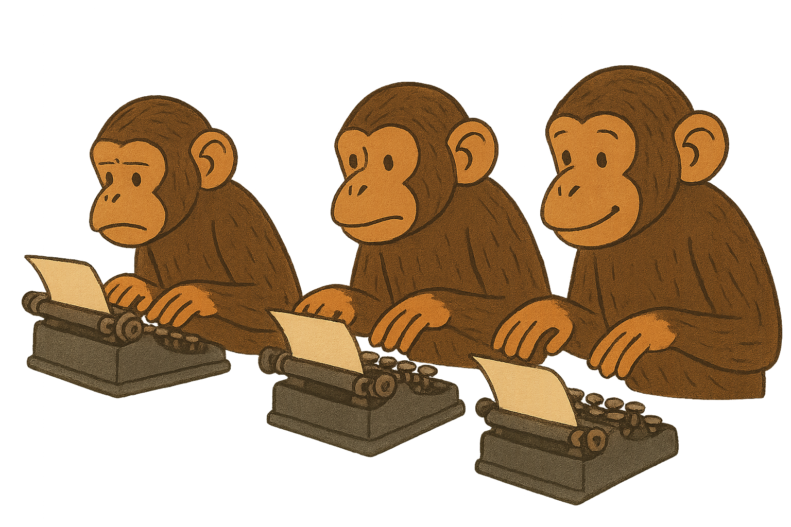

<p align="center">
  
</p>
<h1 align="center">Infinite monkeys</h1>

[](https://gabrielrufino.com)
[](https://github.com/gabrielrufino/infinite-monkeys/actions/workflows/ci.yml)

> The infinite monkey theorem states that a monkey hitting keys at random on a typewriter keyboard for an infinite amount of time will almost surely type any given text, including the complete works of William Shakespeare. Source: [Wikipedia](https://en.wikipedia.org/wiki/Infinite_monkey_theorem)

CLI simulating infinite monkeys

## Getting started

1. Setup the CLI

```sh
git clone https://github.com/gabrielrufino/infinite-monkeys.git
cd infinite-monkeys
npm ci
npm run build
npm link
```

2. Execute the CLI
```sh
monkeys type "Hello" --threads 4
```
